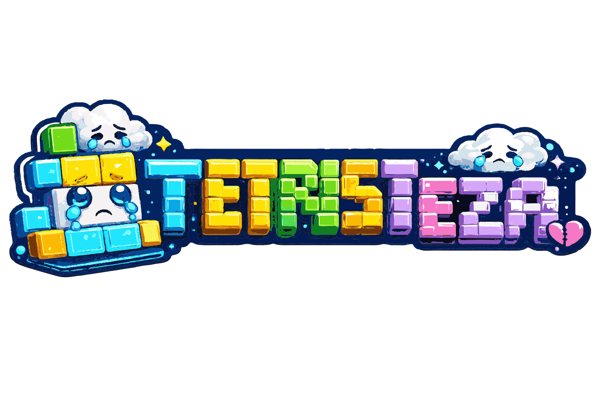
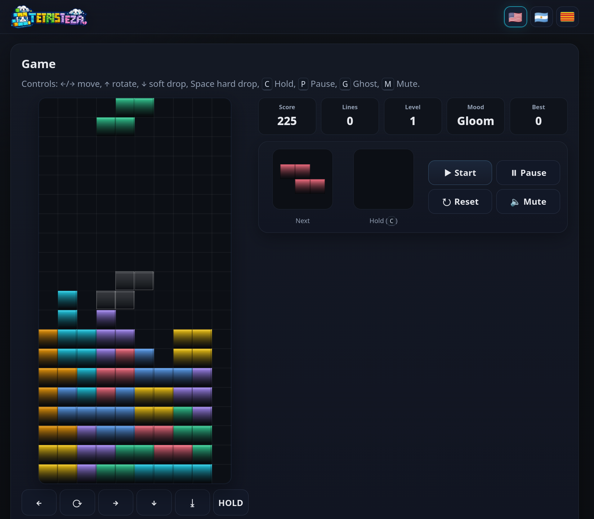

# Tetristeza

  

  <strong>A tiny falling-block puzzler with neon colors and questionable emotional stability.</strong>

Tetristeza is a lightweight browser game built with plain HTML5 Canvas and vanilla JavaScript.

No accounts. No ads. No analytics. No cloud. No package manager. The blocks are already dealing with enough.

> **Play online:** the current v1.1 build is available at **https://santiagorodriguez.com/Tetristeza/**.

## Why

I wanted a falling-block game that could live in a single HTML file, open quickly, and not turn “move some blocks around” into a software architecture conference.

Then I added particles, audio, Hold, Ghost, combos, back-to-back bonuses, and a mood system.

Scope control is a process.

## What it does

- **7-bag randomizer** for fair piece distribution
- **Hold**, **Next**, and **Ghost** piece support
- Smooth movement with **DAS/ARR**, soft drop, and hard drop
- **Scoring, combos, back-to-back bonuses, and levels**
- Lightweight particles and minimal audio through the Web Audio API
- Responsive keyboard and touch controls
- English, Spanish (Argentina), and Catalan interface
- Persistent language preference stored locally in the browser
- HiDPI Canvas rendering
- No framework, runtime dependency, build step, or suspiciously ambitious dependency tree

## Screenshot

  

## Controls

| Action | Key |
| --- | --- |
| Move | `←` `→` |
| Rotate | `↑` |
| Soft drop | `↓` |
| Hard drop | `Space` |
| Hold | `C` |
| Pause | `P` |
| Ghost toggle | `G` |
| Mute | `M` |

On touch devices, use the on-screen controls.

## Play

Play the current v1.1 build at **https://santiagorodriguez.com/Tetristeza/**.

To run it locally:

1. Clone or download this repository.
2. Open `index.html` in a modern browser.
3. Click or tap once before expecting the browser to make noise. Browsers have trust issues with autoplay, and in this case they are probably right.

## Scoring & Levels

- **Single:** 100 × level
- **Double:** 300 × level
- **Triple:** 500 × level
- **Tetris:** 800 × level, with a 50% back-to-back bonus
- **Soft drop:** +1 per cell
- **Hard drop:** +2 per cell
- **Combo:** +50 × level × combo streak
- The level increases every **10 lines**
- Gravity accelerates down to a minimum interval of **120 ms**

## Languages

- 🇺🇸 **English** — default
- 🇦🇷 **Español (Argentina)**
- **Català** — represented in the interface by the traditional Senyera

The selected language is saved locally and can be changed without restarting the current game.

## Author

[Santiago Rodriguez](https://santiagorodriguez.com)

## Technical notes

Tetristeza intentionally stays small. The interface, styles, localization, game logic, and rendering live in `index.html`, alongside a few static assets.

It uses HTML5 Canvas, vanilla JavaScript, CSS, the Web Audio API, and `localStorage`. There is no framework, package manager, compiler, or runtime dependency.

The v1.1 update adds localization, branding, responsive layout, touch-friendly controls, and accessibility polish without changing the core gameplay rules.

## License

Tetristeza is released under the **GNU General Public License v3.0 (GPL-3.0)**. See [LICENSE](LICENSE) for the full license text.
