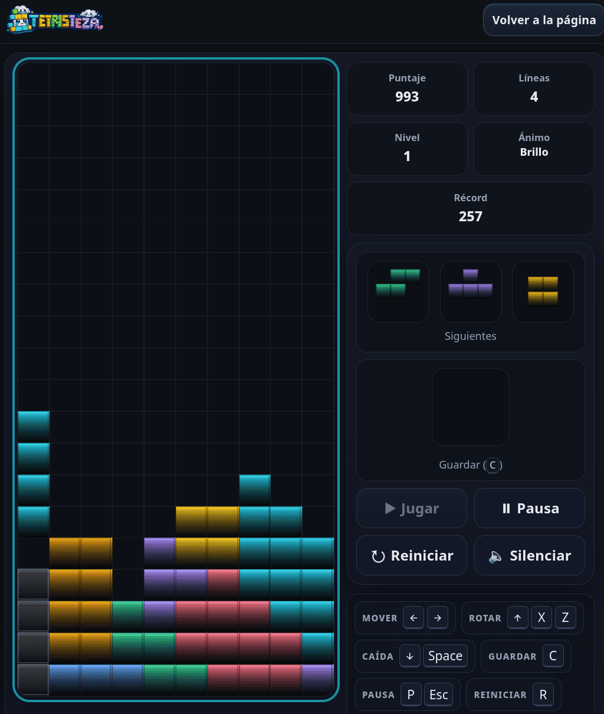

# Tetristeza

  

  <strong>A tiny falling-block puzzler with neon colors and questionable emotional stability.</strong>

  <strong>🇺🇸 English</strong> &nbsp;·&nbsp;
  <strong>🇦🇷 Español</strong> &nbsp;·&nbsp;
   <strong>Català</strong>

Tetristeza is a lightweight browser game built with plain HTML5 Canvas and vanilla JavaScript. Open it, play a few lines, make one terrible decision, repeat as needed.

## Why

I wanted a falling-block game that felt immediate: open it, play it, close it. Simple enough to stay out of the way, but with enough personality to make losing slightly more entertaining.

Then I added Hold, Ghost, particles, actual moods, a global Top 10, and enough wall kicks to make the blocks slightly less vindictive.

## Play

**Online:** play at **https://santiagorodriguez.com/Tetristeza/**.

**Current release:** **v1.4.0**.

**Local:** clone or download the repository, open `index.html`, and press Start. Opening it directly from disk uses an isolated local Top 10 for testing; an HTTP(S) deployment uses the real server leaderboard.

## Screenshot

  

## What it does

Tetristeza keeps the falling-block essentials — **7-bag pieces, Hold, Ghost, a 3-piece Next queue, scoring, combos, levels, and back-to-back bonuses** — with SRS-style rotation and a finite lock delay so pieces eventually have to accept their fate.

It plays with keyboard or touch, adapts the board to the available viewport, remembers your language and personal best, and includes a **global Top 10**. On desktop, the live game can also move into its own resizable window without starting a second session.

Particles, tiny Web Audio noises, HiDPI rendering, and reduced-motion support give it a little polish without making the game feel heavier than it needs to be.

## Controls

| Action | Key |
| --- | --- |
| Move | `←` `→` |
| Rotate clockwise | `↑` or `X` |
| Rotate counter-clockwise | `Z` |
| Soft drop | `↓` |
| Hard drop | `Space` |
| Hold | `C` |
| Pause / Resume | `P` or `Esc` |
| Quick restart | `R` |
| Ghost toggle | `G` |
| Mute | `M` |

On touch devices, use the on-screen controls. Left, right, and soft drop support press-and-hold; Pause stays available in the active mobile control dock. On desktop, **Move to window** transfers the same live game surface to a resizable window; closing it or choosing **Return to page** puts the game back without starting a second session. If the active game window is hidden, the match pauses instead of quietly carrying on without you.

## Scoring & Levels

- **Single:** 100 × level
- **Double:** 300 × level
- **Triple:** 500 × level
- **Tetris:** 800 × level, with a 50% back-to-back bonus
- **Soft drop:** +1 per cell
- **Hard drop:** +2 per cell
- **Combo:** +50 × level × combo streak
- The level increases every **10 lines**
- Gravity accelerates down to a minimum interval of **120 ms**

## Global Top 10

At Game Over, a qualifying score can join the global Top 10 with a name of up to **8 characters** and an optional private email. Only the best ten survive; everyone else is politely forgotten by SQLite. Earlier scores win ties.

It is intentionally an arcade leaderboard, not an esports anti-cheat department.

## Technical notes

The game stays deliberately simple: plain HTML, CSS, and JavaScript. The global Top 10 is a small self-hosted PHP + SQLite service; opening `index.html` directly from disk falls back to an isolated local leaderboard.

The detachable window moves the real game surface instead of mirroring it, so there is still only one board and one game state. Browser support follows modern standards across current Firefox, Chromium-based browsers, and Safari.

The leaderboard database stays outside the public document root by default; `TETRISTEZA_DB_PATH` can point it somewhere else when needed.

## Author

Made by **[Santiago Rodriguez](https://santiagorodriguez.com)**.

## License

Tetristeza is released under the **GNU General Public License v3.0 (GPL-3.0)**. See [LICENSE](LICENSE) for the full license text.
