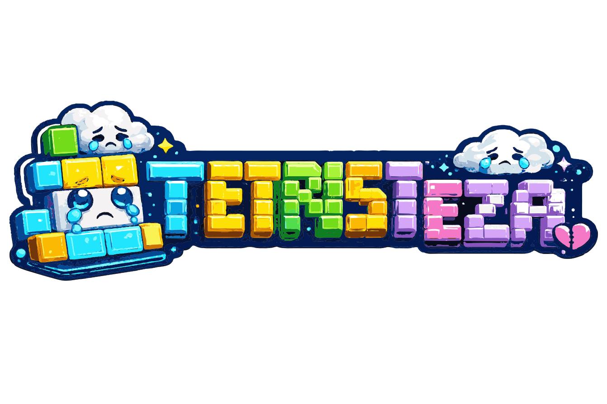
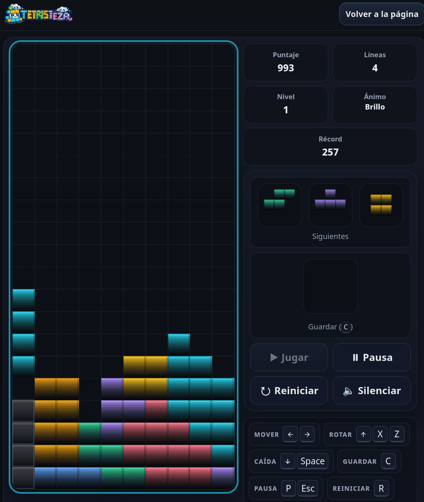

# Tetristeza

  

  <strong>A tiny neon falling-block game with questionable emotional stability.</strong>

  
  
  

  <strong>English</strong> &nbsp;·&nbsp;
  <strong>Español (AR)</strong> &nbsp;·&nbsp;
  <strong>Català</strong>

  Falling blocks. Neon lights. Hold the piece. Trust the Ghost. 
  Make one terrible decision and watch the mood deteriorate.

---

## 🎮 Play

  

No account. No install. No launcher.

Open it in a modern browser and play.

Want it local? Clone or download the repository, open `index.html`, and press **Start**. Direct file opening uses an isolated local Top 10; an HTTP(S) deployment uses the real leaderboard service.

---

## ✨ Why Tetristeza?

I wanted a falling-block game that felt immediate: **open it, play it, close it**.

Then Hold showed up. Then Ghost. Then particles, wall kicks, a global Top 10, three languages, a detachable game window, and an emotional state for the board that nobody technically requested.

It is still deliberately small. No framework, no package manager, no build ceremony.

Just blocks with increasingly complicated feelings.

---

## 🕹️ Highlights

|  |  |  |
| :---: | :---: | :---: |
| **🧱 Proper falling-block core** | **👻 Hold, Ghost & Next** | **🏆 Global Top 10** |
| 7-bag pieces, SRS-style rotation, combos, levels and back-to-back play. | Hold one piece, preview the next three, and decide whether Ghost is helping or judging you. | Qualifying scores can join a shared arcade leaderboard without creating an account. |
| **📱 Touch friendly** | **🪟 Move to window** | **🌐 Three languages** |
| Responsive controls for phone, tablet, mouse, pen and keyboard. | Move the *actual live game* into its own resizable window and bring it back without losing state. | English, Argentine Spanish and Catalan, with the UI adapting around them. |
| **🔊 Tiny audio & particles** | **💾 Remembers the useful stuff** | **⚡ Lightweight by design** |
| Minimal Web Audio tones and restrained effects keep it lively without turning it into a fireworks simulator. | Language, personal Best, Sound and Ghost preferences stay local in your browser. | Plain HTML, CSS and JavaScript. Open `index.html`; that is basically the build system. |

---

## 📸 Gameplay

  

  Current published screenshot: v1.4.0.

---

## ⌨️ Controls

| Action | Keyboard |
| --- | :---: |
| Move | `←` `→` |
| Rotate clockwise | `↑` or `X` |
| Rotate counter-clockwise | `Z` |
| Soft drop | `↓` |
| Hard drop | `Space` |
| Hold | `C` |
| Pause / Resume | `P` or `Esc` |
| Quick restart | `R` |
| Ghost | `G` |
| Sound | `M` |

On touch devices the controls are on screen, including **both rotation directions** and a visible **Ghost** toggle. Left, right and soft drop support press-and-hold.

On desktop, **Move to window** transfers the live game surface into a resizable popup. Close it or choose **Return to page** and the same game comes back.

---

## 🏆 Global Top 10

At Game Over, a qualifying score can enter the global Top 10 with:

- a player name of up to **8 Unicode code points**;
- an optional private email;
- no account or public profile.

Only name and score are ever rendered publicly. Earlier scores win ties.

If a save loses its network response, Tetristeza retries the same protected submission only within the server's 15-minute receipt window. The email draft stays in client memory until submission and is never shown in the public ranking.

It is an arcade leaderboard, not an esports anti-cheat department.

---

<strong>🧮 Scoring & levels</strong>

 

- **Single:** 100 × level
- **Double:** 300 × level
- **Triple:** 500 × level
- **Tetris:** 800 × level
- **Back-to-back Tetris:** +50% when the previous line clear was also a Tetris
- A no-clear placement preserves the B2B chain; Single, Double or Triple breaks it
- **Soft drop:** +1 per cell
- **Hard drop:** +2 per cell
- **Combo:** +50 × level × combo streak
- Level increases every **10 lines**
- Gravity accelerates to a minimum interval of **120 ms**

<strong>🛠️ Technical notes</strong>

 

Tetristeza stays intentionally simple: plain HTML, CSS and JavaScript.

The global Top 10 is a small self-hosted PHP + SQLite service. The database lives outside the public document root by default; `TETRISTEZA_DB_PATH` can point to another private location when needed.

The detachable window moves the real game DOM instead of mirroring it, so there is still only one board, one score and one game state.

Browser POSTs validate the supplied Origin/Referer against the server's own scheme, host and effective port. The small session rate limit is best-effort abuse protection, not authentication or anti-cheat.

Modern Firefox, Chromium-based browsers and Safari are the intended targets.

---

## 👤 Author

Made by **[Santiago Rodriguez](https://santiagorodriguez.com)**.

---

## 📄 License

Tetristeza is released under the **GNU General Public License v3.0 (GPL-3.0)**.

See [LICENSE](LICENSE) for the full license text.
