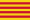
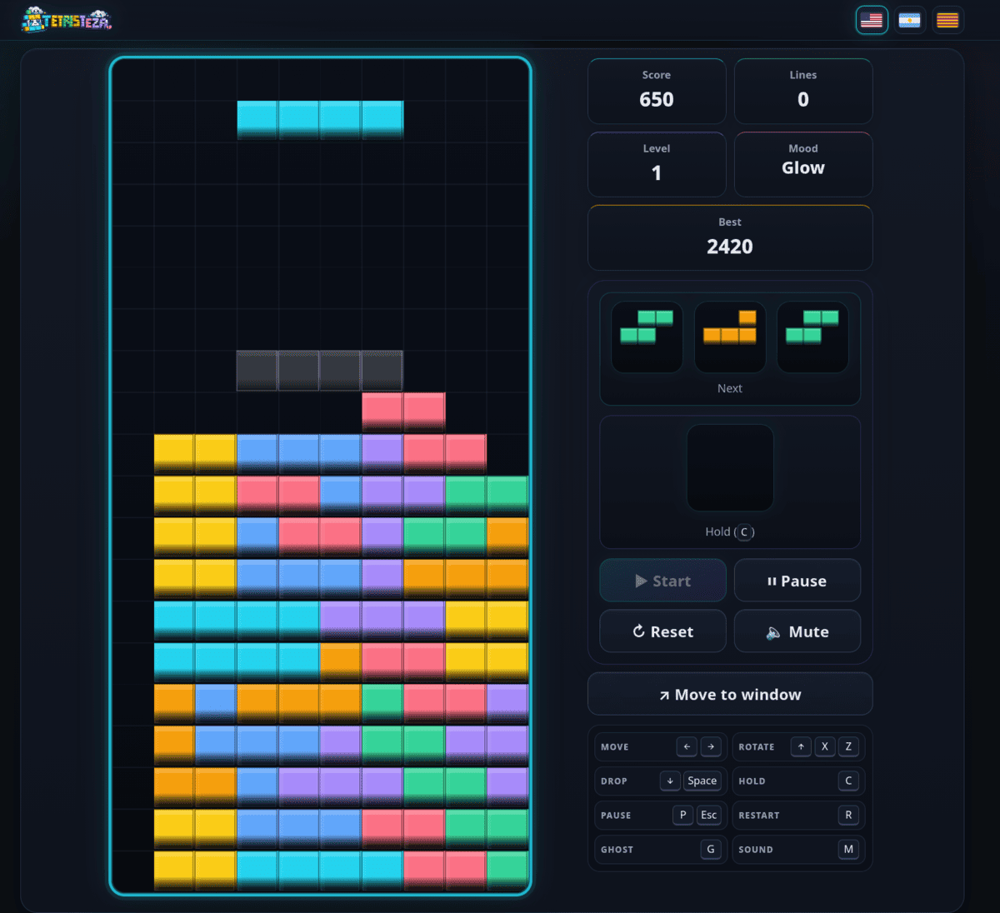

# Tetristeza

  

  <strong>A tiny neon falling-block game with questionable emotional stability.</strong>

  
  
  

   <strong>English</strong>
  &nbsp;·&nbsp;
   <strong>Español</strong>
  &nbsp;·&nbsp;
   <strong>Català</strong>

  Falling blocks, neon colors and increasingly dramatic emotional consequences.

---

## 🎮 Play

  

Play it in a modern browser, or open `index.html` locally.

---

## 📸 Gameplay

  

  Tetristeza v1.5.0 gameplay.

---

## ✨ Highlights

|  |  |  |
| :---: | :---: | :---: |
| **🧱 Arcade core** | **👻 Hold, Ghost & Next** | **🏆 Global Top 10** |
| 7-bag pieces, SRS-style rotation, combos, levels and back-to-back play. | Hold one piece, preview the next three and toggle Ghost whenever optimism becomes suspicious. | Qualifying scores can join a shared arcade ranking. |
| **📱 Touch friendly** | **🪟 Move to window** | **🌐 Three languages** |
| Responsive controls with both rotation directions and press-and-hold movement. | Move the live game into its own resizable window without losing state. | English, Español and Català. |

Sound, Ghost, language and personal Best are remembered locally.

---

## ⌨️ Controls

| Action | Keyboard |
| --- | :---: |
| Move | `←` `→` |
| Rotate | `↑` / `X` · `Z` |
| Soft / hard drop | `↓` · `Space` |
| Hold | `C` |
| Pause / Resume | `P` / `Esc` |
| Restart | `R` |
| Ghost | `G` |
| Sound | `M` |

Touch controls are shown on screen. On desktop, **Move to window** transfers the same running game into a separate resizable window.

---

## 🏆 Top 10

At Game Over, a qualifying score can enter the global Top 10 with a player name and an optional private email.

Only **name and score** are shown publicly. Earlier scores win ties.

If a save loses its network response, retries reuse the same protected submission for the server's 15-minute receipt window.

It is an arcade leaderboard, not an esports anti-cheat department.

---

<strong>🧮 Scoring</strong>

 

- Single: **100 × level**
- Double: **300 × level**
- Triple: **500 × level**
- Tetris: **800 × level**
- Back-to-back Tetris: **+50%**
- Soft drop: **+1 per cell**
- Hard drop: **+2 per cell**
- Combo: **+50 × level × streak**
- Level increases every **10 lines**

<strong>🛠️ Technical notes</strong>

 

Tetristeza is intentionally lightweight: plain HTML, CSS and JavaScript.

The global Top 10 uses a small PHP + SQLite service. The detachable window moves the real game DOM instead of mirroring it, so there is still only one board and one game state.

Modern Firefox, Chromium-based browsers and Safari are the intended targets.

---

## 👤 Author

Made by **[Santiago Rodriguez](https://santiagorodriguez.com)**.

## 📄 License

**GNU General Public License v3.0 (GPL-3.0)** — see [LICENSE](LICENSE).
